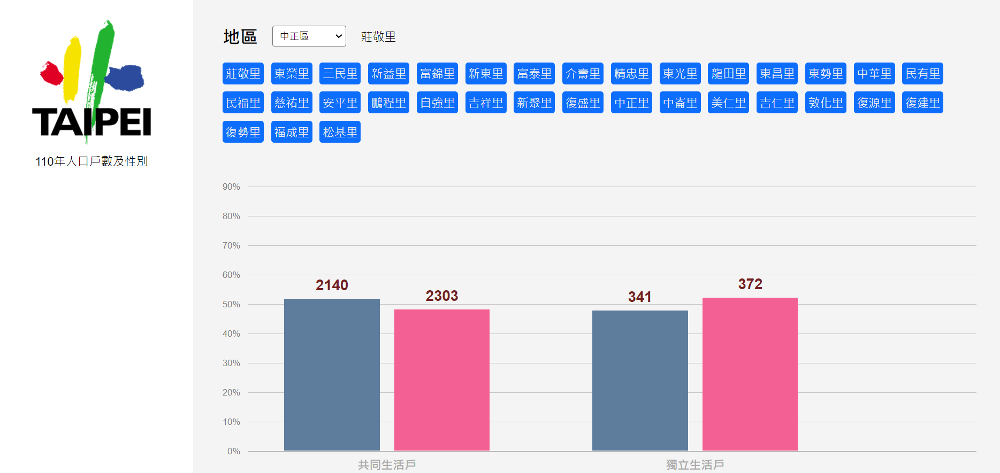

# 政府資料開放平臺

[Live Demo](https://data-gov-fetch.web.app/)



## Architecture

- React.js
- Typescript

## Code quality

- ESLint
- Prettier

## How to run from local

pick a repository, and on terminal

```bash
git clone https://github.com/yuenu/hw2.git
```

then

```bash
cd hw2 && yarn && yarn start
```

Open http://localhost:3000/
