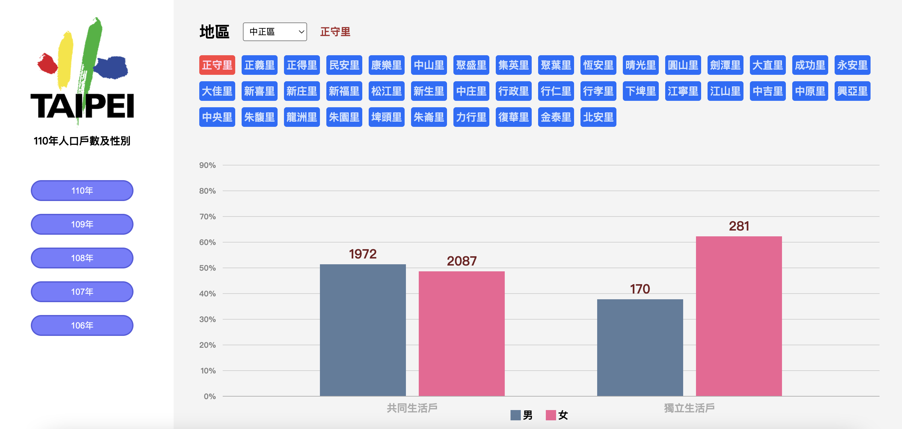
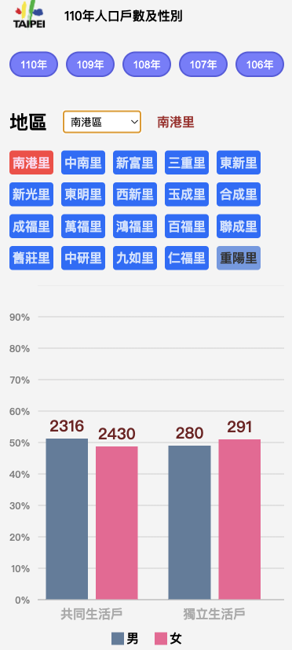

# 政府資料開放平臺

[Live Demo](https://data-gov-fetch.web.app/)

This repo Fetch data from: [reference](https://data.gov.tw/dataset/14299)





## Built with

- Semantic HTML5 markup
- CSS custom properties
- Flexbox
- [React.js](https://reactjs.org/) - using react hook
- Typescript - for pass type check
- [Firebase](https://firebase.google.com/) - for depoly
- Github Actions - every time commit will re-build the project and deploy on firebase

## Code quality

- ESLint
- Prettier

## How to run from local

pick a repository, and on terminal

```bash
git clone https://github.com/yuenu/hw2.git
```

then

```bash
cd hw2 && yarn && yarn start
```

Open http://localhost:3000/
